# Multimedia Cheatsheet

## Video crop factors

### Common Digital Video Formats

Format | Dimensions | Aspect Ratio
|----- |:----------:| -----------:|
|HD    |   1280x720 |         16:9|
|FHD   |  1920x1080 |         16:9|
|4K-UHD|  3840x2160 |         16:9|
|4K-DCI|  4096x2160 |      256:135|
|5K    |  5120x2880 |         16:9|
|6K    |  6144x3456 |         16:9|
|8K    |  7680x4320 |         16:9|

### Cinemascope (2.35:1)

Format  | 2.35:1 (47:20) | Letterbox |   FFmpeg Crop
| ----- |---------------:|----------:|---------------:|
|HD     |       1280x544 |        88 |   1280:544:0:88|
|FHD    |       1920x816 |       132 |  1920:816:0:132|
|4K-UHD |      3840x1632 |       264 | 3840:1632:0:264|
|4K-DCI |      4096x1744 |       208 | 4096:1744:0:208|
|5K     |      5120x2176 |       352 | 5120:2176:0:352|
|6K     |      6144x2608 |       424 | 6144:2608:0:424|
|8K     |      7680x3264 |       528 | 7680:3264:0:528|

### Cinemascope (2.40:1)

Format  | 2.40:1 (12:5) | Letterbox |   FFmpeg Crop
| ----- |--------------:|----------:|---------------:|
|HD     |      1280x528 |        96 |   1280:528:0:96|
|FHD    |      1920x800 |       140 |  1920:800:0:140|
|4K-UHD |     3840x1600 |       280 | 3840:1600:0:280|
|4K-DCI |     4096x1712 |       224 | 4096:1712:0:224|
|5K     |     5120x2128 |       376 | 5120:2128:0:376|
|6K     |     6144x2560 |       448 | 6144:2560:0:448|
|8K     |     7680x3200 |       560 | 7680:3200:0:560|

### Ultra Panavision 70 (2.76:1)

Format  | 2.76:1/69:25 | Letterbox |  FFmpeg Crop
| ----- |-------------:|----------:|---------------:|
|HD     |     1280x464 |       128 |  1280:464:0:128|
|FHD    |     1920x688 |       196 |  1920:688:0:196|
|4K-UHD |    3840x1382 |       384 | 3840:1382:0:384|
|4K-DCI |    4096x1488 |       336 | 4096:1488:0:336|
|5K     |    5120x1856 |       512 | 5120:1856:0:512|
|6K     |    6144x2224 |       616 | 6144:2224:0:616|
|8K     |    7680x2784 |       768 | 7680:2784:0:768|

### 4K-DCI

Format  | 4K-DCI (256:135) | 2.35:1 Letterbox |   FFmpeg Crop
| ----- | ----------------:|-----------------:|---------------:|
|HD     |         1280x672 |               24 |   1280:672:0:24|
|FHD    |        1920x1008 |               36 |  1920:1008:0:36|
|4K-UHD |        3840x2032 |               64 |  3840:2032:0:64|
|4K-DCI |        4096x2160 |                0 |   4096:2160:0:0|
|5K     |        5120x2704 |               88 |  5120:2704:0:88|
|6K     |        6144x3248 |              104 | 6144:3248:0:104|
|8K     |        7680x4048 |              136 | 7680:4048:0:136|

## Slow motion percentage
From    |  to  | Perc.
|------:|-----:|------:|
|  59.94|    24|   40% |
| 119.88|    24|   20% |
| 239.76|    24|   10% |
|  59.94| 29.97|   50% |
| 119.88| 29.97|   25% |
| 239.76| 29.97| 12.5% |
|  59.94|    60|  100% |
| 119.88|    60|   50% |
| 239.76|    60|   25% |

## EOS R5 ProRes RAW and CinemaDNG 5K (5120 x 2696)

|     ProRes RAW     |    Mbps   |   MB/s   | GB x Min |
|-------------------:|----------:|---------:|---------:|
|             23.976 |    967.03 |   120.88 |     7.25 |
|                 24 |       968 |      121 |     7.26 |
|                 25 |  1,008.33 |   126.04 |     7.56 |
|              29.97 |  1,208.79 |    151.1 |     9.07 |
|                 30 |  1,210.00 |   151.25 |     9.08 |
|                 60 |  2,420.00 |    302.5 |    18.15 |

| DNG No Compression | Mbps      | MB/s     | GB x Min |
|-------------------:|----------:|---------:|---------:|
|             23.976 |  5,295.43 |   661.93 |    39.72 |
|                 24 |  5,300.72 |   662.59 |    39.76 |
|                 25 |  5,521.59 |    690.2 |    41.41 |
|              29.97 |  6,619.28 |   827.41 |    49.64 |
|                 30 |  6,625.90 |   828.24 |    49.69 |
|                 60 | 13,251.80 | 1,656.48 |    99.39 |

| DNG Lossless       | Mbps      | MB/s     | GB x Min |
|-------------------:|----------:|---------:|---------:|
|             23.976 |  2,844.44 |   355.55 |    21.33 |
|                 24 |  2,847.28 |   355.91 |    21.35 |
|                 25 |  2,965.92 |   370.74 |    22.24 |
|              29.97 |  3,555.55 |   444.44 |    26.67 |
|                 30 |  3,559.10 |   444.89 |    26.69 |
|                 60 |  7,118.20 |   889.78 |    53.39 |

| DNG 3:1            | Mbps      | MB/s     | GB x Min |
|-------------------:|----------:|---------:|---------:|
|             23.976 |  1,237.23 |   154.65 |     9.28 |
|                 24 |  1,238.47 |   154.81 |     9.29 |
|                 25 |  1,290.07 |   161.26 |     9.68 |
|              29.97 |  1,546.54 |   193.32 |     11.6 |
|                 30 |  1,548.09 |   193.51 |    11.61 |
|                 60 |  3,096.17 |   387.02 |    23.22 |

| DNG 5:1            | Mbps      | MB/s     | GB x Min |
|-------------------:|----------:|---------:|---------:|
|             23.976 |     474.7 |    59.34 |     3.56 |
|                 24 |    475.18 |     59.4 |     3.56 |
|                 25 |    494.98 |    61.87 |     3.71 |
|              29.97 |    593.38 |    74.17 |     4.45 |
|                 30 |    593.97 |    74.25 |     4.45 |
|                 60 |  1,187.95 |   148.49 |     8.91 |

| DNG 7:1            | Mbps      | MB/s     | GB x Min |
|-------------------:|----------:|---------:|---------:|
|             23.976 |    282.21 |    35.28 |     2.12 |
|                 24 |    282.49 |    35.31 |     2.12 |
|                 25 |    294.26 |    36.78 |     2.21 |
|              29.97 |    352.76 |    44.09 |     2.65 |
|                 30 |    353.11 |    44.14 |     2.65 |
|                 60 |    706.22 |    88.28 |      5.3 |

## HDR Video Characteristics

Based on the [QuickTime File Format and ProRes Video Parameter Editing](https://github.com/bbc/qtff-parameter-editor).

The colour primaries can be selected from the list:

| No.  | Colour Primaries  |
| -----| --------------    |
|0     | Reserved          |
|1     | ITU-R BT.709      |
|2     | Unspecified       |
|3     | Reserved          |
|4     | ITU-R BT.470M     |
|5     | ITU-R BT.470BG    |
|6     | SMPTE 170M        |
|7     | SMPTE 240M        |
|8     | FILM              |
|9     | ITU-R BT.2020     |
|10    | SMPTE ST 428-1    |
|11    | DCI P3            |
|12    | P3 D65            |

The transfer function can be selected from the list:

| No.  | Transfer Function                   |
| -----| ---------------------------------   |
|0     | Reserved                            |
|1     | ITU-R BT.709                        |
|2     | Unspecified                         |
|3     | Reserved                            |
|4     | Gamma 2.2 curve                     |
|5     | Gamma 2.8 curve                     |
|6     | SMPTE 170M                          |
|7     | SMPTE 240M                          |
|8     | Linear                              |
|9     | Log                                 |
|10    | Log Sqrt                            |
|11    | IEC 61966-2-4                       |
|12    | ITU-R BT.1361 Extended Colour Gamut |
|13    | IEC 61966-2-1                       |
|14    | ITU-R BT.2020 10 bit                |
|15    | ITU-R BT.2020 12 bit                |
|16    | SMPTE ST 2084 (PQ)                  |
|17    | SMPTE ST 428-1                      |
|18    | ARIB STD-B67 (HLG)                  |

The colour matrix can be selected from the list:

| No.  | Colour Matrix                  |
| -----| ---------------------------    |
|0     |GBR                             |
|1     |BT709                           |
|2     |Unspecified                     |
|3     |Reserved                        |
|4     |FCC                             |
|5     |BT470BG                         |
|6     |SMPTE 170M                      |
|7     |SMPTE 240M                      |
|8     |YCOCG                           |
|9     |BT2020 Non-constant Luminance   |
|10    |BT2020 Constant Luminance       |

## YouTube Chapters with Resolve.
1. Create markers in your timeline using the same color.
2. Open the index panel.
3. Clic on the three dot button and select to view only your color markers.
4. Clic on the three dot button and select `Export Edit Index` to save your CSV file.
5. Using the macOS Terminal, run this command replacing your CVS file name:

```sh
{
  echo "00:00 - Start"
  tail -n +2 Timeline\ 1.csv | \
  awk -F',' '{print $10 " - " $21}' | \
  grep -v "Marker 1" | \
  awk -F'[:, -"]+' '{printf "%02d:%02d - %s\n", $2, $3, $7}'
} > output.txt
```

## Sony Codecs
|   Sony Format   | Resolution |    Codec   |    CM    |
|:---------------:|:----------:|:----------:|:--------:|
| XAVC HS 4K      |  3840x2160 | HEVC/H.265 | Long GOP |
| XAVC S 4K       |  3840x2160 | AVC/H.264  | Long GOP |
| XAVC S HD       |  1920x1080 | AVC/H.264  | Long GOP |
| XAVC S-I 4K     |  3840x2160 | AVC/H.264  | Intra    |
| XAVC S-I HD     |  1920x1080 | AVC/H.264  | Intra    |
| XAVC S-I DCI 4K |  4096x2160 | AVC/H.264  | Intra    |

## Custom LUT for the FX30 with the Ninja V and Resolve

* [Set the FX30 to output S-Log3](#set-the-fx30-to-output-s-log3)
* [Download and fix the Technical LUTs](#download-and-fix-the-technical-luts)
* [Loading the Technical LUT into the Ninja V](#atomos-ninja-v-settings)
* [White balance and exposure using the Ninja V](#white-balance-and-exposure)
* [DaVinci Resolve Grading and LUT Creation](#davinci-resolve-grading-and-lut-creation)
* [Loading the custom LUT in the FX30](#custom-lut-in-the-fx30)
* [Display the Custom LUT](#display-the-custom-lut)

### Set the FX30 to output S-Log3

1. Press the `MENU` button, go to `2` `Main2`, and enter the `Log Shooting Setting`.

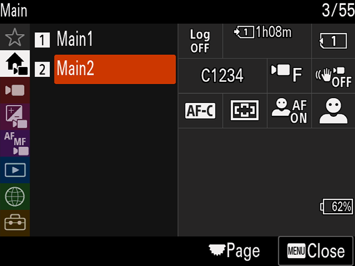
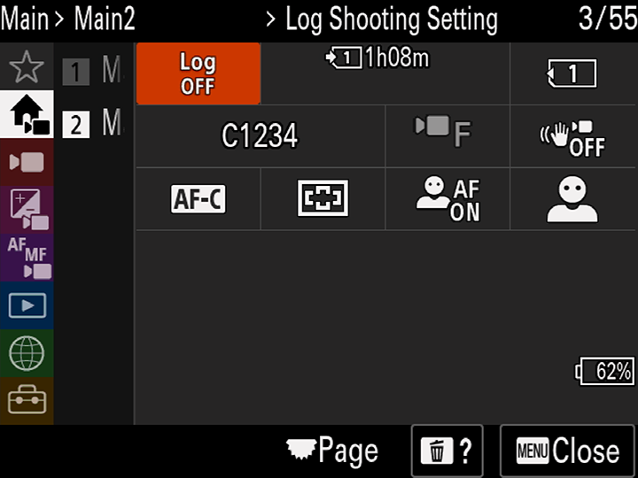


2. Select `Log Shooting` and set it to `Cine EI`.

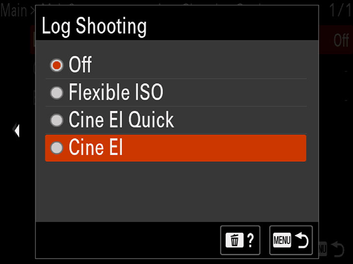
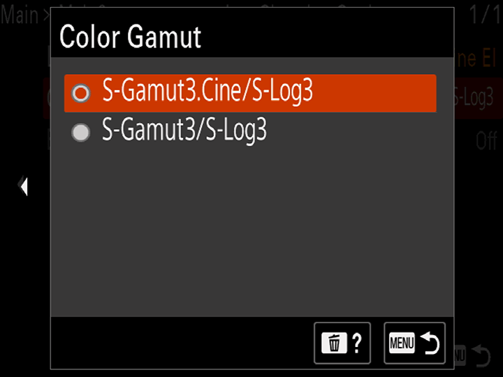

3. Under `Color Gamut`, select `S-Gamut3.Cine/S-Log3`.


4. Go to `Main1` menu, and select the `Select LUT` option.


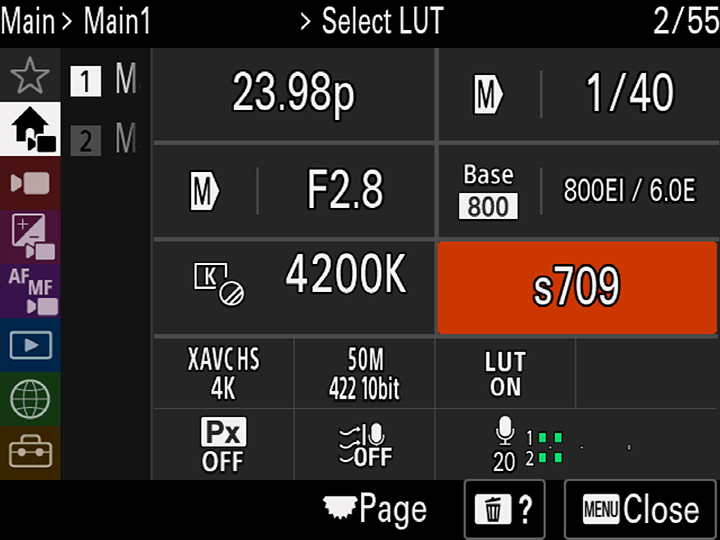

5. Under `Select LUT`, choose `S-Log3`.

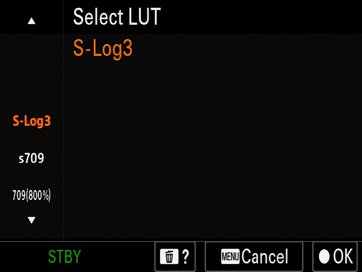

6. Under the `Display LUT` option, select `Off`.

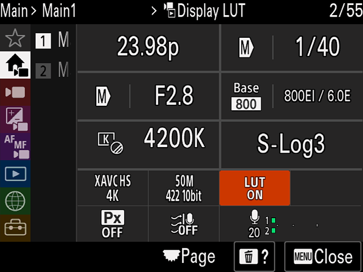
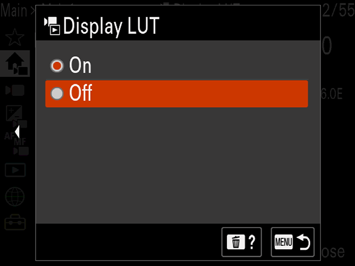

### Download and fix the Technical LUTs

The Sony FX30 Technical LUTs are [available on their official website](https://alphauniverse.sony-asia.com/learn/fx-30/luts-library) and can be directly downloaded following this link:
[Technical LUT_Standard.zip](https://alphauniverse.sony-asia.com/sites/default/files/2024-01/Technical%20LUT_Standard.zip)

> Note that the `slog3_sgamut3_cine_to_rec709.cube`, `slog3_sgamut3_cine_to_rec709_-1stop.cube`, `slog3_sgamut3_cine_to_rec709_-2stop.cube`, and `slog3_sgamut3_cine_to_rec709_-3stop.cube` files use the `[TAB]` character to define the LUT size. You'll need to edit each file to replace the tab character with a space in order to load the LUTs into the Atomos Ninja V.

Original `slog3_sgamut3_cine_to_rec709.cube` file with `[Tab]`:
```
# HDLINK 3D LOOKUP TABLE
# BlackMagic cube from Truelight v4.0

LUT_3D_SIZE 16

0.0000 0.0000 0.0000
0.0013 0.0000 0.0000
...
```

Modified file `slog3_sgamut3_cine_to_rec709.cube` with `[Space]`:
```
# HDLINK 3D LOOKUP TABLE
# BlackMagic cube from Truelight v4.0

LUT_3D_SIZE 16

0.0000 0.0000 0.0000
0.0013 0.0000 0.0000
...
```

### Atomos Ninja V Settings

#### Loading the Technical LUT

1. Copy the `slog3_sgamut3_cine_to_rec709.cube` file onto the Ninja V's SD Sata Drive, then plug it into the Ninja V.
2. Select the gear icon on the bottom right of the screen.
3. Navigate to the `LUTs` tab.
4. Choose the desired LUT slot to load the LUT, then tap on the folder icon.
5. Select the `slog3_sgamut3_cine_to_rec709.cube` LUT.
6. Navigate to the `Monitor` setting and select `LUT`.

#### White balance and exposure
1. Do NOT enable any toggles under the `Input` tab.
2. Enable False Colors for exposure, adjusting the exposure on the FX30 while shooting at an 18% Grey Card.
3. Using the RGB Parade, set your White Balance while shooting at an 18% Grey Card.
4. Record a sample footage using an X-Rite/Calibrite ColorChecker Video or a similar card for custom grading.

### DaVinci Resolve Grading and LUT Creation
1. Load the Technical LUT into Resolve by copying the file into Resolve's LUT folder, located in `/Library/Application Support/Blackmagic Design/DaVinci Resolve/LUT` on macOS, and `C:\ProgramData\Blackmagic Design\DaVinci Resolve\Support\LUT` on Windows.

2. After copying the `slog3_sgamut3_cine_to_rec709.cube` Technical LUT, navigate to the `Color` tab. Right-click in the LUTs panel to access the contextual menu, then refresh to display the Technical LUT in the list.

3. Under the `Edit` tab, import your Atomos Ninja V ProRes HQ footage and create a timeline with the footage.

4. Set the `Data Levels` of each clip to `Full`.

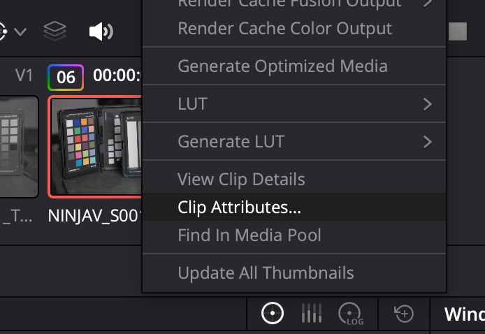
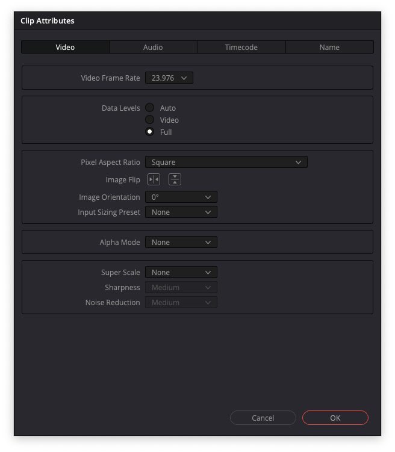

5. Under the `Color` tab, apply the Technical LUT to your clips, and perform your custom grading using Color Wheels, Curves, Color Wraper, etc. Note that effects and Color Space Transforms may not work well while creating LUTs.

6. After grading, right-click on the clip, select `Generate LUT`, and choose `33 Point Cube`, which **is the maximum number of points the FX 30 allows**. Save the `.cube` LUT.

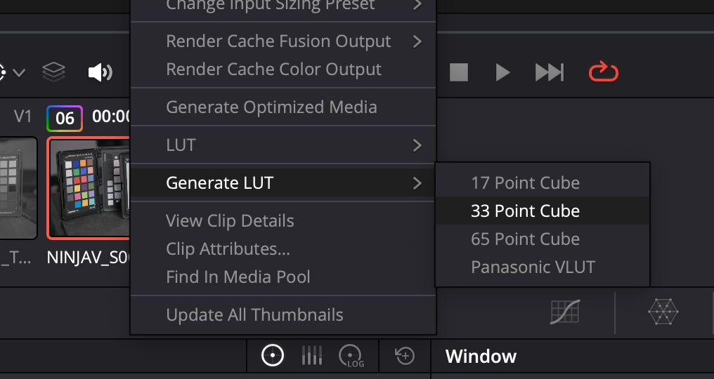

### Custom LUT in the FX30

#### Loading the custom LUT from memory

1. Copy your `.cube` LUT onto your SD or CF card. For SD cards, the path for the LUTs is `PRIVATE/SONY/PRO/LUT`. For CF cards, the path is `SONY/PRO/LUT`.

```
CF root
└── SONY
    └── PRO
        └── LUT
```

On the SD-Card
```
SD root
└── private
    └── SONY
        └── PRO
            └── LUT
```

2. Insert the memory card into your Sony FX30 camera. Go to the `Exposure/Color` pink menu.

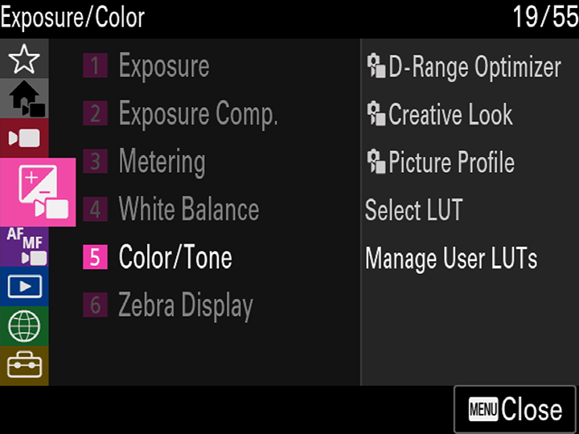

3. Select the `5` `Color/Tone` menu.

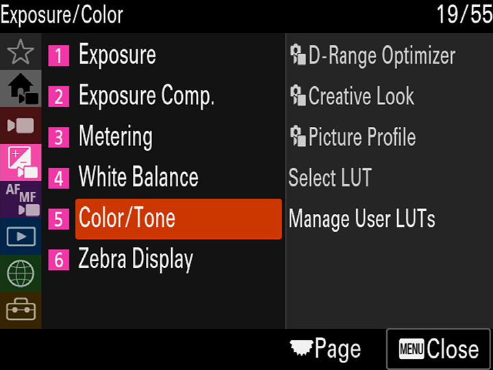

4. Choose `Manage User LUTs`.

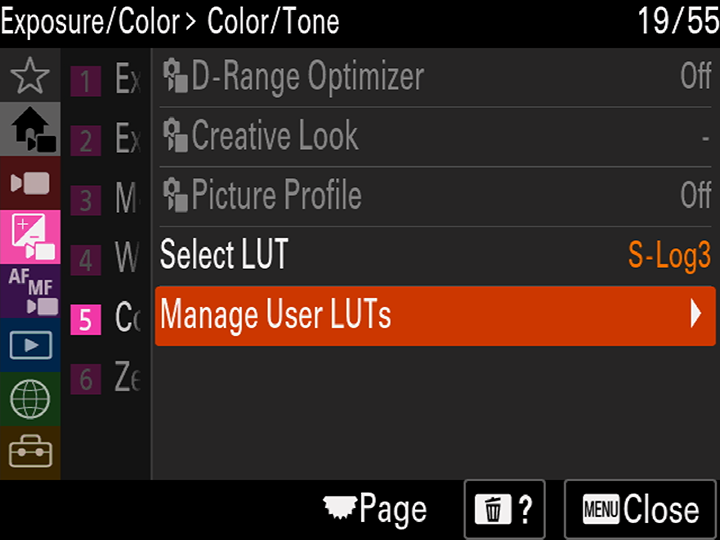

5. Select `Import/Edit`.

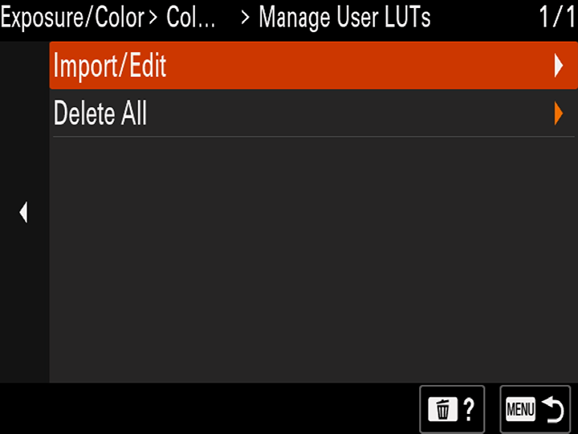

6. Choose the slot to load the LUT.

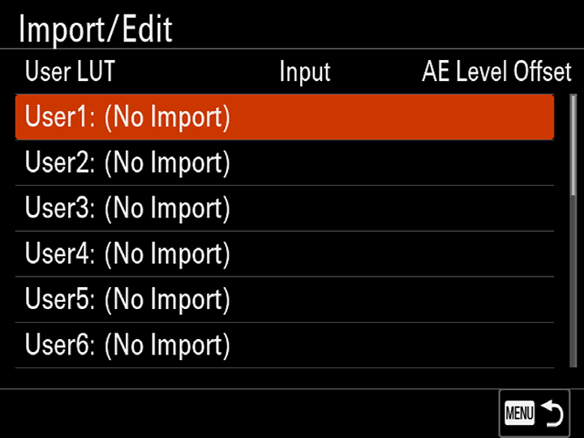

7. Select `Media`.

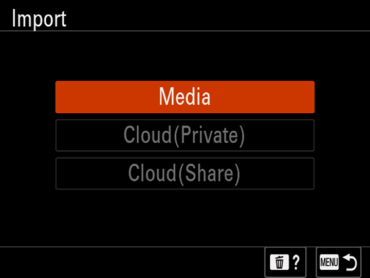

8. Choose the media slot.

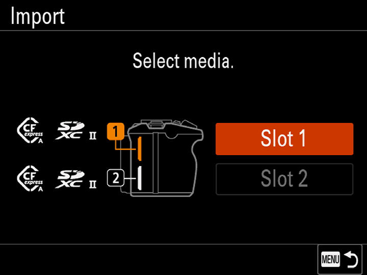

9. Select the LUT file.

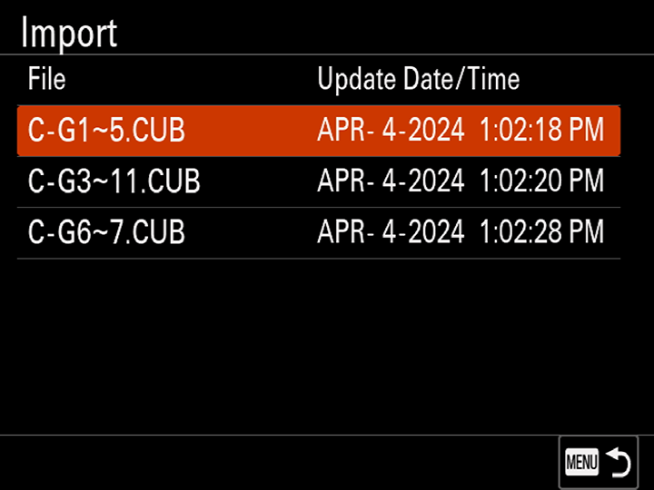
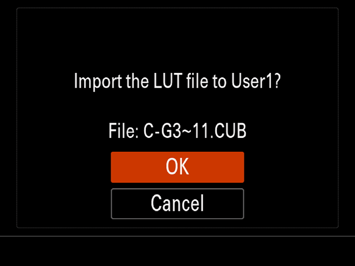
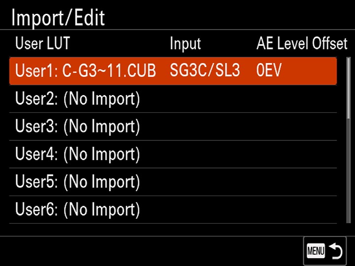

#### Display the Custom LUT

1. Navigate to the `Main1` menu.

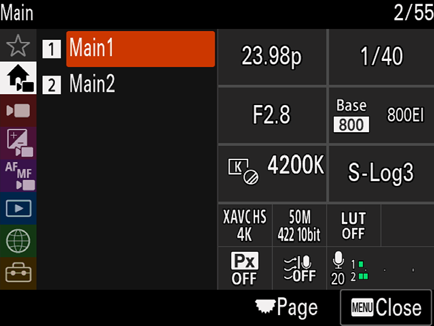

2. Enter `Select LUT`.


3. Choose your custom LUT.


4. Enable the `Display LUT` option.


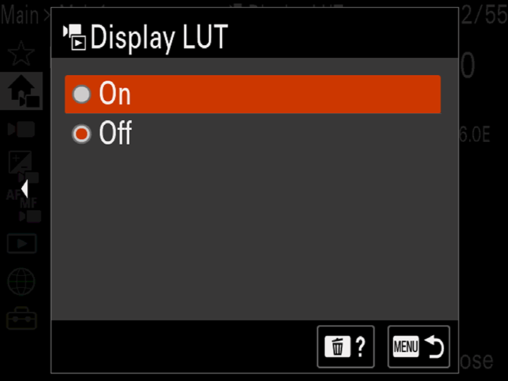

*Voilà!* Now you can preview and output your custom LUT through HDMI and record internally in `S-Gamut3.Cine/S-Log3`.

### OCR for VobSub2SRT in macOS

Install
```sh
brew install tesseract
brew install tesseract-lang
wget https://raw.githubusercontent.com/leonard-slass/VobSub2SRT/master/packaging/vobsub2srt.rb
sed -i '' 's/ruediger/leonard-slass/;s/git:/https:/' vobsub2srt.rb
brew install --HEAD vobsub2srt.rb
```

OCR
```sh
vobsub2srt --tesseract-lang spa "File.SPA"
```
